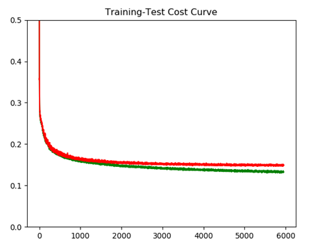
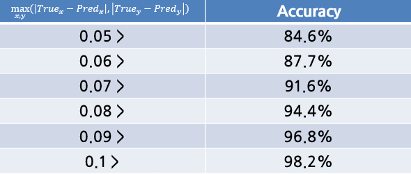

Prediction of 4 vertices of plates using Deep Learning
===

 데이터마이닝 과목 프로젝트로서 딥러닝을 이용해 자동차의 네 꼭지점의 좌표 위치를 추정하는 `Regression`문제를 해결하고자 하였다. 대표적인 딥러닝 모델로 `CNN (Convolutional Neural Network)`와 `RNN (Recurrent Neural Network)`가 있다. 이 중  `CNN`은 이미지 처리 문제를 해결하는데 많이 사용되고,  `RNN`은 자연어 처리 문제를 해결하는데 널리 사용되고 있다.

  사실 `CNN`은 인터넷의 많은 예제들 처럼 단순히 분류 문제를 해결하는 도구로만 알고 있었다. 하지만 많은 특징들을 모아서 하나의 `Class`를 나타내는 것과 실수 값을 뽑는 문제가 별개라는 생각은 들지 않았다. 따라서 `CNN`을 이용해 `Regression`문제를 해결하는 것이 가능하리라 생각했다.

  `Object`가 사각형이라고 가정할 때 `Object`의 정확한 네 점을 찾는 문제는 여러 분야에서 응용이 가능하다. `Image Processing`의 `Perspective Transform`을 이용하면 객체의 네 점을 이용해 비틀어진 이미지를 바로 펼 수 있는데, 바로 핀 이미지는 차후 인식 문제라던지 카메라로 이미지를 스캔하는 문제라던지 응용 여지가 충분히 있다고 볼 수 있다.

  #### DataSet

  이번 문제를 해결하기 위한 데이터셋은 직접 수집한 데이터로 진행하였다. 등하교길에 촬영한 약 1400여 장의 사진을 데이터로 사용했고, 일련의 프로그램을 사용해 네 꼭지점을 이루는 절대좌표를 0과 1사이로 `정규화`를 시켰다.

  ###### <이미지 예시>
  
  ```
  18주0229_0.95.jpg 0.10795 0.12698 0.87500 0.38095 0.86932 0.88889 0.11364 0.58730
14구4066_0.95.jpg 0.11218 0.12000 0.87821 0.29333 0.87821 0.92000 0.12179 0.72000
49너3110_0.93.jpg 0.10289 0.60284 0.89389 0.09220 0.89711 0.39007 0.12540 0.91489
37구7730_0.87.jpg 0.13043 0.18391 0.85217 0.08046 0.84348 0.81609 0.13913 0.91954
55하1184_0.93.jpg 0.12895 0.34783 0.89474 0.13043 0.88684 0.66304 0.13947 0.91304
64우8529_0.90.jpg 0.13077 0.56522 0.83077 0.08696 0.88462 0.43478 0.19231 0.86957
34소4974_0.96.jpg 0.09942 0.16923 0.90643 0.12308 0.89474 0.81538 0.11696 0.89231
37저1597_0.84.jpg 0.08962 0.21698 0.89623 0.07547 0.93868 0.76415 0.16038 0.93396
01소2194_0.95.jpg 0.10736 0.12963 0.89571 0.14815 0.90184 0.88889 0.14417 0.87037
11너8694_0.85.jpg 0.14583 0.14286 0.84722 0.06349 0.86806 0.84127 0.15278 0.92063
65더6478_0.93.jpg 0.12963 0.58730 0.89352 0.09524 0.90278 0.38889 0.17593 0.89683
48오8359_0.94.jpg 0.13333 0.30303 0.88889 0.12121 0.85185 0.84848 0.09630 0.93939
  ```
  위의 정보들 중 첫번째는 파일명 그 뒤로 있는 8개의 0과 1사이의 값들은 좌표를 나타낸다.
  `[x1 y1 x2 y2 x3 y3 x4 y4]`의 형태이고 `[x1 y1]`은 좌측 상단의 위치 좌표, `[x2 y2]`는 우측 상단의 위치 좌표, `[x3 y3]`는 우측 하단의 위치 좌표, `[x4 y4]`는 좌측 하단의 위치 좌표를 나타낸다.
  차후 모델을 구성할 때 다시 설명하겠지만, 첫번째, 네번째 좌표는 이미지의 x축을 기준으로 중앙보다 좌측에 있어야하고, 두번째, 세번째 좌표는 우측에 있어야함이 보장되어야 한다.
  모든 라벨이 조건을 만족하는 지 확인하기 위해 파이썬 스크립트를 작성하였다.

  ```python
  import os
from PIL import Image
new_file_name = "HK_dataset_align_labels_9.txt"


f = open(new_file_name, 'r')
label_list = f.readlines()
count = 0
for _label in label_list:
    label = _label.replace("\n", '')
    label = label.split(" ")
    c = label[1:]
    c = list(map(float, c))

    if c[0] > 0.5 or c[6] > 0.5 or c[2]  < 0.5 or c[4] < 0.5:
        print(label[0],end=" ")
        print(c)
        count+=1

print("Done")
print(count)
  ```


위의 결과 화면으로 볼 때 앞에서 말한 조건을 위배하는 데이터는 없는 것으로 보인다.

#### Data loading for Deep Learning
이미지를 딥러닝 모델에 넣기 위해 같은 사이즈의 숫자형 배열로 넣어줘야한다. 파이썬에서는 배열을 처리하기 위한 `numpy`모듈이 있기 때문에 쉽게 처리가 가능하다. 또한 라벨 데이터도 모델의 형식에 알맞게 `ground truth`로 넣어준다.
틀린 이미지가 무엇인지 눈으로 직접 보기 위해 `파일명`도 넣어주고, 번호판을 이루는 `width`와 `height`도 넣어준다.

```python
import os
import numpy as np
import cv2
from PIL import Image, ImageEnhance
label_paths=['HK_dataset_align_labels.txt'] #가지고 있는 라벨 파일
image_paths = ['./AlignImages'] #이미지 폴더
image_size = (128, 128) # Resize 할 크기

def rounding(x):
    return round(x, 6) #반올림을 하기 위한 함수
def load_dataset(augmented=False):
    image_list = []
    labels = []
    file_names = []
    w_h_list = []
    for idx, label_path in enumerate(label_paths):
        f = open(label_path, 'r')
        label_list = f.readlines()
        for _label in label_list:
            try:
                label = _label.replace("\n", '')
            except:
                continue
            label = label.split(" ") #라벨 데이터에서 한 줄을 읽어 리스트 형태로 만듬
            file_name = label[0] #첫번째는 파일 명
            coord = list(map(float, label[1:])) #두번째 줄 부터는 실수형 리스트로 만듬
            try:
                image = Image.open(os.path.join(image_paths[idx], file_name))
                # 이미지를 연다.
            except:
                continue
            image = image.resize(image_size, resample=Image.BILINEAR)#Image Resize
            #보간법으로 Bi-linear 테크닉을 사용하였다.
            image_list.append(np.array(image)) #배열 형태로 넣어준다.
            file_names.append(file_name) # 파일명 추가.
            # [x1, y1, x2, y2, x3, y3, x4, y4]
            labe = np.array([[coord[0], coord[1], coord[6], coord[7]], [coord[2], coord[3], coord[4], coord[5]]])
            #배열을 새로운 형태로 만든다. 윗줄은 x값이 0.5보다 작은 1, 4번 좌표
            #아랫줄은 0.5보다 큰 2, 3번 좌표
            labels.append(labe)

            width = max(coord[::2]) - min(coord[::2]) #번호판의 폭
            height = max(coord[1::2]) - min(coord[1::2])#번호판의 높이

            w_h_list.append(np.array([width, height]))

            image_list = np.array(image_list)

    labels = np.array(labels)
    labels = labels.astype(np.float32)
    w_h_list = np.array(w_h_list)
    w_h_list = np.expand_dims(w_h_list, axis=1)
    return image_list, labels, file_names, w_h_list
```
위 함수를 통해 딥러닝에 필요한 데이터를 모두 알맞게 전처리할 수 있다.
1400여 장의 이미지를 수집하였지만, 딥러닝으로 효과적인 결과를 얻기 위해서는 데이터가 약간 부족한다. `Classification`문제를 해결하기는 괜찮을 수 있는 수량일지는 몰라도 보다 정교하게 예측해야하는 `Regression`문제를 더 정확하게 수행하기 위해서는 여전히 부족한 데이터 수다.

`Data Augmentation`을 효율적으로 이용하면 조금 더 정교하게 예측을 하지 않을까 생각했다.
사실 번호판의 네 꼭지점을 예측하는 데 있어서 번호판 안이 어떻게 구성되어있는지 중요할까? 라는 생각이 먼저 들었다. 어떤 형태로든 이 곳이 번호판이라는 것을 사람의 눈으로 확인할 수 있다면 이미지에 적절한 변형을 가해줘도 괜찮을 것이라 생각되었다.
여기서 사용한 테크닉은 좌우 반전, 상하 반전, 상하 좌우 반전이다. 비록 번호판 안의 내용은 반전된 글자들이겠지만, 번호판의 형태를 파악하는 데에는 아무런 지장이 없다.
위의 데이터 로드 함수에서 `augmented` 옵션을 `True`로 설정해 주면 자동적으로 반전된 데이터와 라벨을 추가하게 된다.


```python
if augmented == True: # Image augmentation options: flip

      image_ud = cv2.flip(np.array(image), 0) #이미지 상하 반전
      label_ud = np.round_(np.array([[coord[6], 1-coord[7], coord[0], 1-coord[1]],[coord[4], 1-coord[5], coord[2], 1-coord[3]]]), 5)

      image_list.append(image_ud)
      labels.append(label_ud)
      file_names.append(file_name)
      w_h_list.append(np.array([width, height]))

      image_lr = cv2.flip(np.array(image), 1) # 이미지 좌우반전
      label_lr = np.round_(np.array([[1-coord[2], coord[3], 1-coord[4], coord[5]], [1-coord[0], coord[1], 1-coord[6], coord[7]]]), 5)

      image_list.append(image_lr)
      labels.append(label_lr)
      file_names.append(file_name)
      w_h_list.append(np.array([width, height]))

      image_udlr = cv2.flip(image_ud, 1) #상하 반전한 이미지에 좌우 반전 추가
      label_udlr = np.round_(np.array([[1-coord[4], 1-coord[5], 1-coord[2], 1-coord[3]],[1-coord[6], 1-coord[7], 1-coord[0], 1-coord[1]]]),5)
      image_list.append(image_udlr)
      labels.append(label_udlr)
      file_names.append(file_name)
      w_h_list.append(np.array([width, height]))
```

#### 딥러닝 모델 설계

문제를 해결하기 위해 파이썬의 딥러닝 라이브러리 중 하나인 `Tensorflow`를 사용하였다.
`Convolution Layer`와 `Maxpooling Layer`를 겹겹이 쌓아 특징을 추출하고 네트워크의 하단부에서 `VALID Convolution`을 진행해 좌표를 추출할 수 있도록 하였다.

```python
def model(x, keep_drop=keep_drop):
    x_norm = tf.cast(x,tf.float32) / 255.0 #data normalize

    net = slim.conv2d(x_norm , 64, kernel_size=(3, 3))
    net = slim.max_pool2d(net, (2, 2)) # 64 64

    net = slim.conv2d(net, 128, kernel_size=(3, 3))
    net = slim.max_pool2d(net, (2, 2)) # 32 32

    net = slim.conv2d(net, 256, kernel_size=(3, 3))
    net = slim.max_pool2d(net, (2, 2)) # 16 16

    net = slim.conv2d(net, 512,kernel_size=(3, 3))
    net = slim.max_pool2d(net, (2, 2)) # 8 8

    net = slim.conv2d(net, 1024, kernel_size=(3, 3))
    net = slim.max_pool2d(net, (2, 2))# 4 4

    net = slim.conv2d(net, 1024, kernel_size=(3, 3))
    net = tf.nn.dropout(net, keep_prob=1)
    net = slim.max_pool2d(net, (2, 2)) #  2 2

    net = tf.nn.dropout(net, keep_prob=1)
    net = slim.conv2d(net, 1024, kernel_size=(2, 1), padding='VALID') #1 2
    net = tf.nn.dropout(net, keep_prob=1)
    net = slim.conv2d(net, 4, kernel_size=(1, 1))

    net = tf.squeeze(net, axis =1)

    return net

```
네트워크의 초입에는 저차원 특징(색깔, 점)을 조금만 추출하고 하단으로 가면 갈수록 보다 고차원적인 특징(형태, 질감)을 많이 추출한다. 마지막 `VALID Convolution`을 진행하기 전 `Feature map`의 형태는 `2(W) x 2(H) x 1024(Channel)`의 형태가 된다. 여기서 `VALID Convolution`을 진행하면 `2(W) x 1(H) x 1024(Channel)`형태가 된다. 위에서 데이터가 x축 기준 0.5를 넘는 좌표와 넘지 않는 좌표를 구분하는 이유가 여기에 있다. 각 `Width` 격자 1개에서 2개의 좌표를 추출해야 하기 때문이다.
마지막으로 `1 x 1 Convolution`은 `Full Connection`과 같은 역할을 하는데 이 `Layer`를 거치고 나면 최종적으로 `2(W) x 1(H) x 4(Channel)`이 된다. `Squeeze`를 통해 `2(H) x 4(W)`의 형태가 완성되고 여기서의 출력값과 `ground truth`의 값과 비교해가면서 오차를 줄여나가게 된다.

```python
with tf.name_scope('Optimizer'):
       cost = tf.reduce_mean(tf.abs(Y-logits)) # MAE
       optimizer = tf.train.GradientDescentOptimizer(learning_rate=0.08).minimize(cost)
```
위의 코드 조각은 오차를 계산하는 방식과 오차를 줄여나가는 알고리즘을 세팅한 것이다.
오차는 실제값과 출력값의 절대값 오차의 평균을 낸 것이고, 오차를 줄여나가는 방식은 일반적인 `Gradient Descent`방식을 이용하였다. 이 방식은 `Global minimum`에 근접할 때 까지 일정한 간격으로 오차를 줄여나가게된다.

###### 성공적으로 예측한 사례


###### 예측 실패 사례


#### 성능 측정
위 모델의 성능을 측정하기 위해 두가지의 지표를 사용할 수 있다.
하나는 `Ground Truth`와 `Prediction`의 유클리드 거리의 평균을 사용하는 방법이 있다. 유클리드 거리란 피타고라스의 정리를 이용해 x좌표 값의 차이의 제곱과 y좌표 값의 차이의 제곱의 합의 양의 제곱근이다. 이 방식은 평균적으로 번호판의 위치와 예측이 얼마나 떨어져있는 지 나타내는 지표이다.
다른 하나는 x 좌표 값의 차이 y 좌표 값의 차이 중 가장 큰 값만 측정하는 방식이다.
이 두 가지의 방식은 차후 문제를 어떤 방식으로 접근하느냐에 따라 효율이 달라질 수 있다.
번호판을 기준으로 인식 문제를 수행할 때 x축 `projection`을 이용해 글자를 인식하게 되면 전자의 접근이 더 효율적인 접근이 될 것이고,
정확한 규격에 딱 알맞도록 맞추려고 할 때는 후자의 지표가 더 효율적인 접근이 될 것이다.
각각의 지표를 측정하는 파이썬 함수는 아래와 같이 작성하였다.

```python
#측정 지표 1
def cal_mean_distance(pred, y):
    mean_dis = 0
    for j in range(4):
        mean_dis += math.sqrt(math.pow(pred[i][j][0]-y[i][j][0], 2) + math.pow(pred[i][j][1]-y[i][j][1], 2))/ 4
    return mean_dis
```
```python
#측정 지표 2
def cal_max_distance(pred, y): #calculate maximum distance / 1 batch_size
    max_dis = 0
    for i in range(len(pred)):
        max = -1
        a = pred[i].reshape(4, 2)
        b = y[i].reshape(4, 2)
        for j in range(4):
            if max < np.abs(b[j][0]-a[j][0]):
                max = np.abs(b[j][0]-a[j][0])
            if max < np.abs(b[j][1]-a[j][1]):
                max = np.abs(b[j][1]-a[j][1])
        max_dis += max / len(pred)
    return max_dis
```

위의 지표2를 그래프로 나타내기 위해 학습하는 중간의 로그를 모두 기록하였다.
```
epoch:0 Train 0.5459439121186733 0.6277382895452055 0.621836245059967 0.7483799167112868
epoch:1 Train 0.510136216878891 0.5532431273382497 0.46392741799354553 0.5146751439300449
epoch:2 Train 0.38657451048493385 0.34073823235759687 0.355093315243721 0.28251929405060683
epoch:3 Train 0.3664056621491909 0.296864786987955 0.3592495173215866 0.2918493840437044
epoch:4 Train 0.3344598673284054 0.2548797402497043 0.3521949499845505 0.2722023177350109
epoch:5 Train 0.3305043838918209 0.245313043657013 0.3269525617361069 0.23973932053555136
epoch:6 Train 0.3139658197760582 0.22380231934176245 0.31233879923820496 0.22206550329246305
epoch:7 Train 0.30052783712744713 0.20720316294072705 0.29670384526252747 0.20177792752330959
epoch:8 Train 0.29156602546572685 0.19629588028162037 0.29380057752132416 0.20098902560770504
```
왼쪽 두개의 실수는 `Training Dataset`에 대한 `Cost`과 `지표2`의 결과값이고,
오른쪽 두개는 `Test Dataset`에 대한 결과이다.

`log.txt`에 기록한 데이터를 그래프로 나타내기 위해 아래와 같은 스크립트를 작성하였다.

```python
import matplotlib.pyplot as plt
import numpy as np
import os


training_cost_list = []
test_cost_list = []
tr_mean_list = []
test_mean_list = []

f = open("./model/saved_final/log.txt", 'r')
log_list = f.readlines()

for log in log_list:
    log = log.replace("\n", '')
    log = log.split(" ")
    training_cost_list.append(float(log[2]))
    test_cost_list.append(float(log[4]))
    tr_mean_list.append(float(log[3]))
    test_mean_list.append(float(log[5]))


#인자만 변경해줌으로서 그래프를 다시 그릴 수 있다.
plt.plot(list(range(len(training_cost_list))), tr_mean_list, color='green')
plt.plot(list(range(len(test_cost_list))), test_mean_list, color='red')
plt.title("Training-Test Mean max distance Curve")
plt.ylim(0, 0.5)
plt.show()
```



학습을 약 6000 epoch을 수행하였다. 그 결과 크긴 않지만 `Training`과 `Test`의 결과의 차이가 조금씩 벌어지는 것을 확인할 수 있었는데, 약하게나마 `Overfitting`이 발생함을 확인하였다.
학습을 수 만 epoch을 진행하면 할수록 이 격차는 더 벌어지리라 생각된다.

#### Accuracy
성공적으로 예측한 비율을 알기 위해서 여러가지 기준을 두고 `Accuracy(정확도)`를 측정하였다. 위에서 설명한 `지표 2`를 기준으로 5%부터 10%미만까지의 각각의 경우에 대해 정확도를 측정하였다.
정확도를 얼마나 타이트하게 기준으로 잡을 것인지는 사용자에게 달려있다.



#### 개선의 여지
모델을 평가하고 보니, 생각보다 성능이 아주 높지는 않았다. 특히 비틀어진 번호판에 대해서 예측을 상당부분 잘못하다고 생각하는데, 비틀어진 데이터가 상대적으로 부족하였기 때문이라고 생각한다.
하나 추가할 수 있는 것은 현재 `Image Tilt`로만 진행했던 `Data Augmentation`을 `Rotation`을 이용한 `Augmentation`을 추가하는 것이다. 그러면 한장의 이미지에 대해 데이터를 360 여장을 추가로 얻을 수 있는데, 미처 시도하지는 못했다.
현재의 성능을 획득하는데 GTX TITAN X GPU로 15여 시간 정도가 걸렸기 때문에 현재보다 나은 컴퓨팅 환경이 구축된다면 시도해 볼 법 한 것 같다.
두번째 개선의 여지는 아무래도 사람이 직접 라벨링 한 것이기 때문에, 오차가 있을 수 있다. 만약 라벨링 한 값이 오차가 크다면 이는 모델 성능에 아주 안좋은 영향을 미치기 때문에 시간을 들여 이러한 데이터를 제거해준다면 성능이 올라가리라 생각된다.
